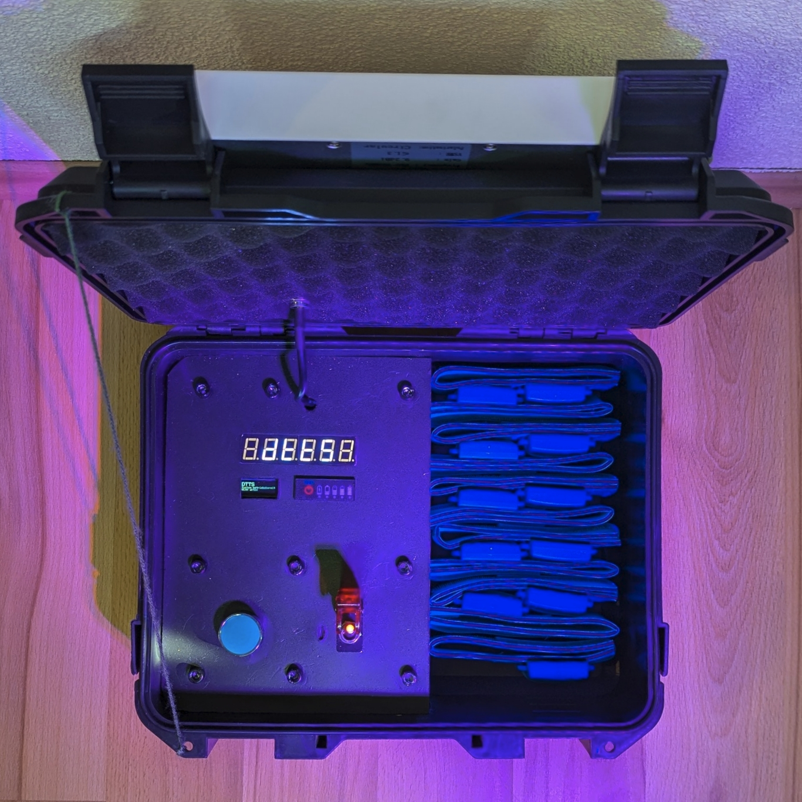
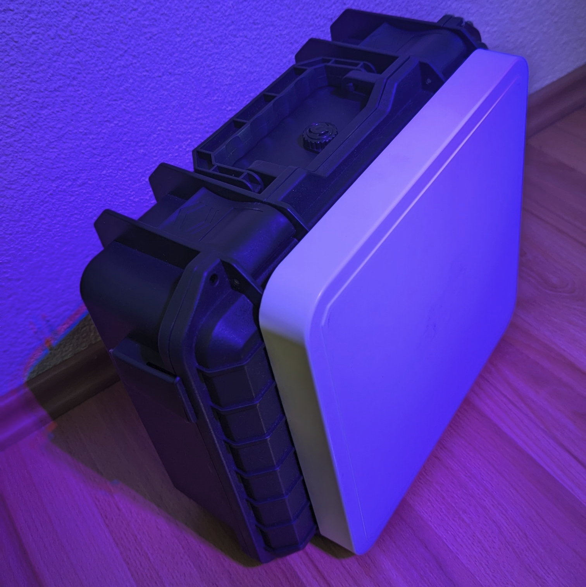
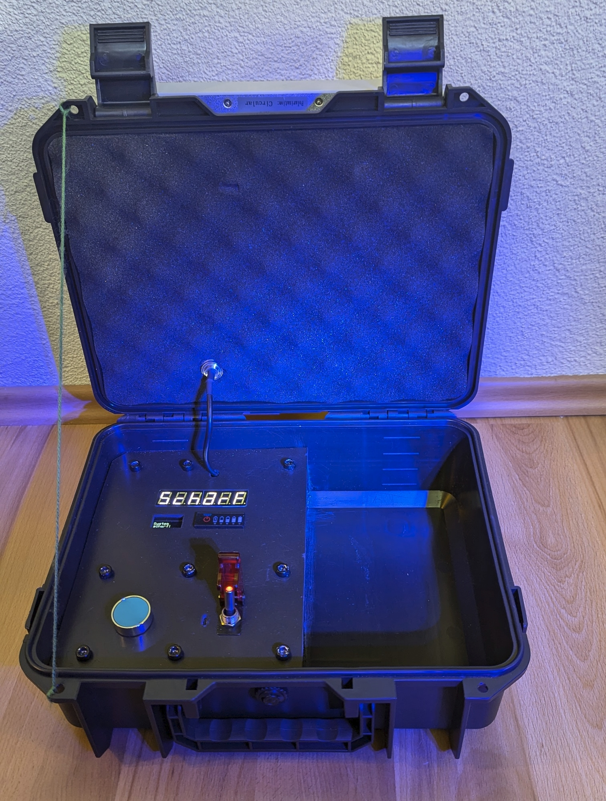
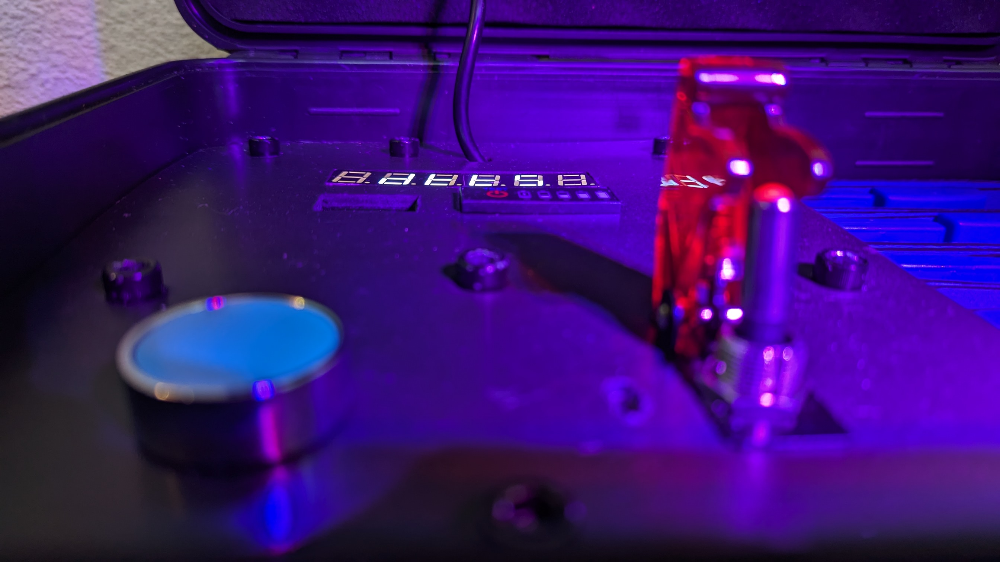
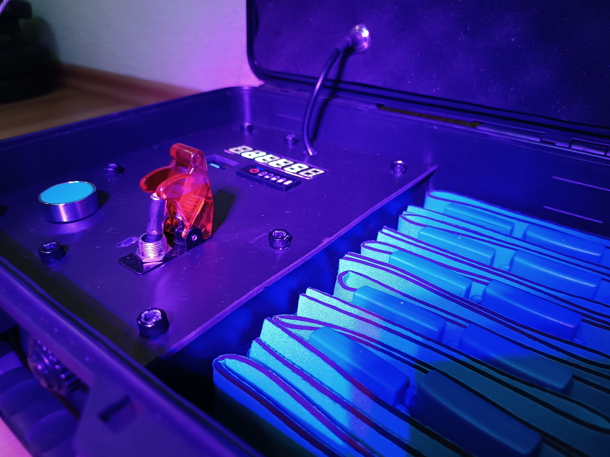
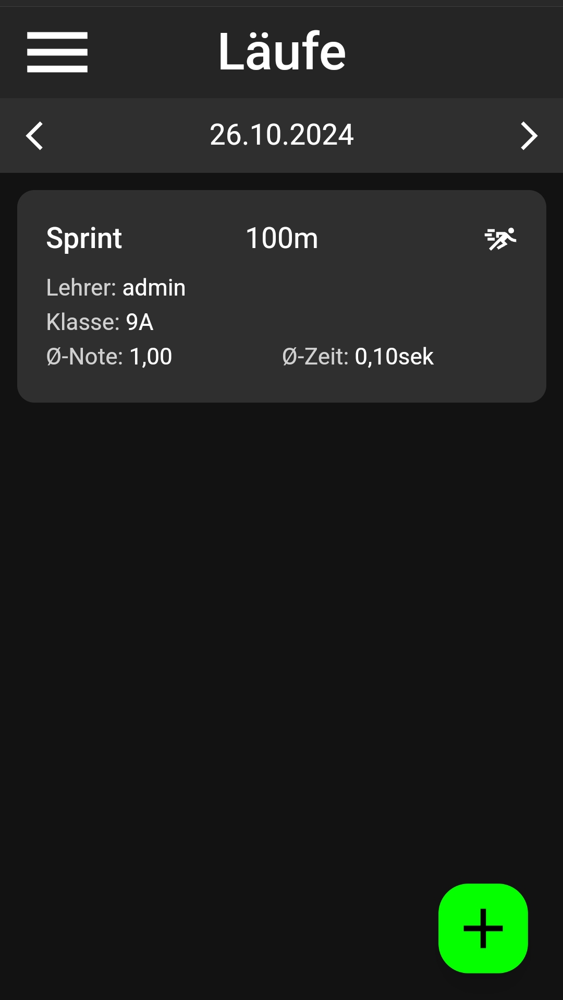
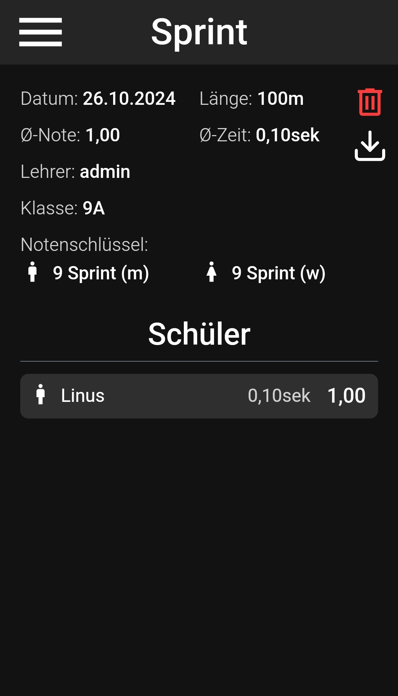
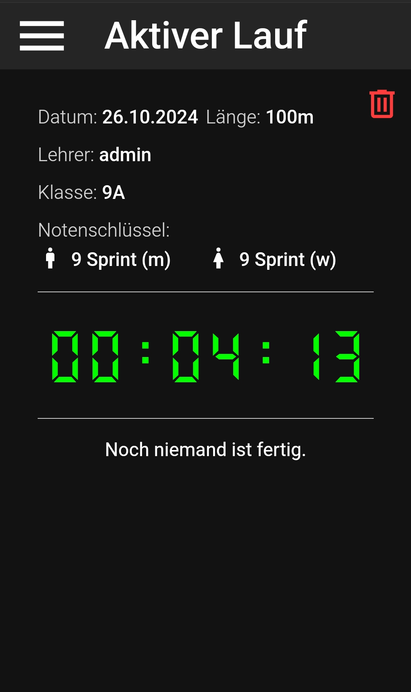

# DTTS

The code for the open-source time tracking device DTTS, built for the ESP32.

    
    

## Idea

The motivation behind this project started when we realized how tedious time tracking is for teachers when they measure time for sprints or lap runs. The current solutions are either very expensive, not very user friendly, not made for school use or simply do not exist.

We then thought about building our own solution, which would be relatively cheap, as we would use Chinese components and write our own software on a cheap chip, the ESP32. It would also be very user friendly and specifically made for school use, which would include automatically calculating grades and the average grades of students and classes.

We decided on making the interface web-based and add the possibility for PWA (Progressive Web App). This way, we wouldn't have to ship or build an app, and it can always be shipped with a new version of the software.

Now how did we plan on tracking the time? After some consideration and glossing over different methods like light barriers, we finally settled on RFID, a UHF tag scanning wireless protocol. It would provide enough range (5 meters) to let students run next to each other. The trigger delay is also relatively short. 

## Features

- quick detection of runners
- two different tracking modes: lap runs and sprints
- automatic grade calculation based on grading keys
- automatic average grade calculation on entire classes
- long battery life
- USB-C charging
- detection via assigned tags
- classes (groups) and gender (different grades) support
- web app
- user and teacher friendly
- different teacher and administrator users
- simple display devices (7 segment and small OLED screen)
- relatively budget-friendly components
- automatic half round support (when students have to run 7,5 laps for example)

## Technologies Used

### Hardware

- **YPD R200 (with 9.2db circular antenna)** for RFID
- **ESP32** (any WROOM devkit)
- buck boost converter from battery to 5V
- TP4056 USB-C charge controller
- 3 lithium 18650 cells in parallel (don't do that it's a bad idea)
- modified SD card to micro SD adapter to serve as an SD card reader
- small OLED display (0,91inch white)
- start button
- hard plastic housing (340x270x125MM)
- fighter switch as a battery power switch
- charge display (1S Lithium)
- 10 RFID tags (UHF 860-960Mhz)
- 7 segment display to show time

All these hardware products combined cost around (usually less) **250€**, which is _extremely_ reasonable for what it offers.

### Software

- Custom code in C++ providing the core functionality
- [Arduino Framework](https://github.com/espressif/arduino-esp32) for the ESP32
- [PlatformIO](https://platformio.org) for dependency management
- [ESPAsyncWebserver](https://github.com/me-no-dev/ESPAsyncWebServer) for serving the website
- [LittleFS](https://github.com/littlefs-project/littlefs) for the filesystem
- [SQL library](https://github.com/siara-cc/esp32_arduino_sqlite3_lib) for the database
- [ArduinoJSON](https://arduinojson.org) for client/server communication
- [Adafruit SSD1306](https://github.com/adafruit/Adafruit_SSD1306) for the OLED display
- [Custom library](https://github.com/DoubleD-Software/DTTS/blob/master/src/tm1637.cpp) for the 7 segment display
- [Svelte](https://svelte.dev) as the website framework
- [TailwindCSS](https://tailwindcss.com) for simple CSS formatting
- And other [libraries](https://github.com/DoubleD-Software/DTTS/blob/master/website/package.json) for the website part

## Issues

During the project's development and after, we have noticed a few key issues that impact the use of the device. They also make it unsuitable for actual and frequent use and sadly cannot be fixed without major changes.
This project served as a really nice learning experience and trying out new and undiscovered things. 

- webserver requires multiple page reloads for the whole page to be served (as Svelte builds into many files, which the ESP32 can't handle very well)
- range isn't as good as promised
- signal can easily be blocked, which means that runners have to have the tag oriented in the right direction, and there is a high chance of multiple runners going through the gate at a similar time blocking each other
- tracking is unreliable for over two people because of the afore mentioned issues
- antenna is powerful enough to detect tags within the tag compartment, so they have to be taken out

## Images

    
    
    

